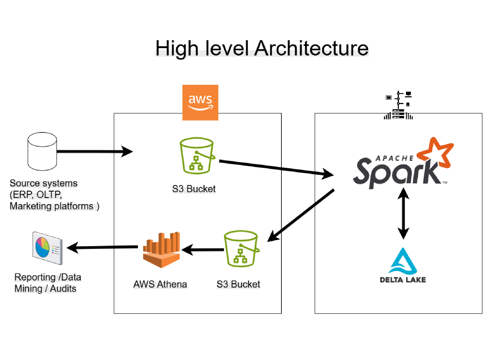
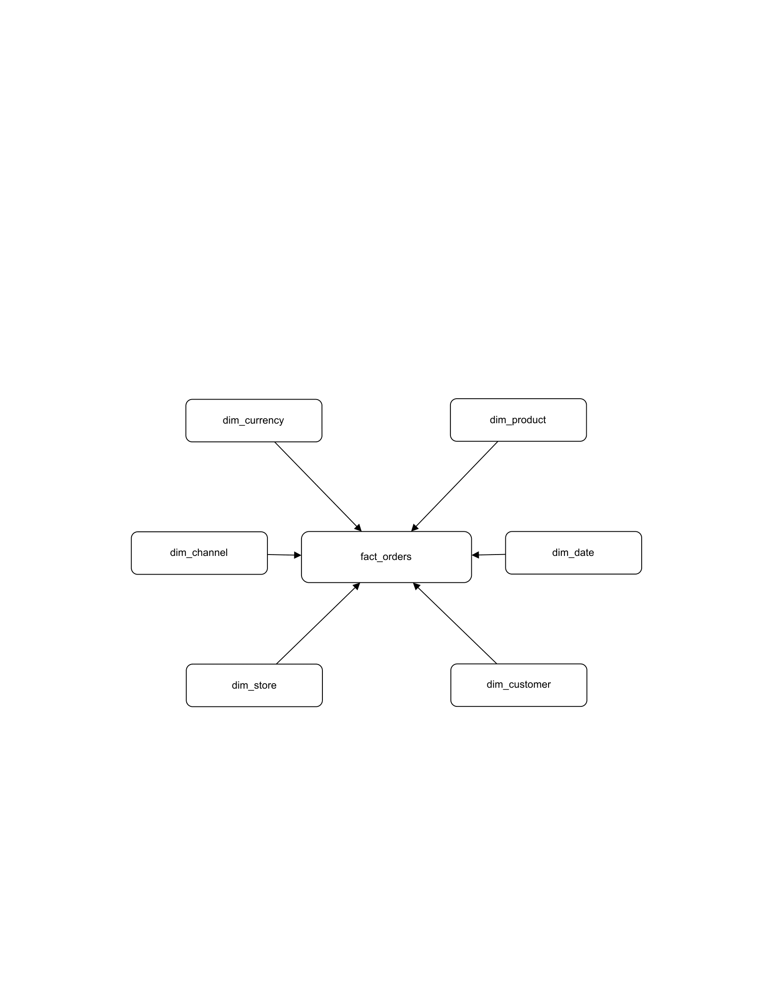

# E-Commerce Lakehouse Data Engineering Pipeline

This project demonstrates an end-to-end **Data Engineering pipeline for an E-Commerce platform** built using **Apache Spark, Delta Lake, and AWS S3** following the **Lakehouse Medallion Architecture (Bronze → Silver → Gold)**.

The pipeline ingests raw operational datasets, processes and standardizes them, and transforms them into analytics-ready fact and dimension tables for reporting and business intelligence.

This project demonstrates key **Data Engineering concepts**, including:
- ETL pipeline design
- dimensional data modeling
- scalable Spark data processing
- lakehouse architecture implementation

---

# Architecture

The project implements a modern **Lakehouse architecture** where data flows through multiple layers:

1. **Bronze Layer**
   - Raw ingestion of source data
   - Stores original source datasets with minimal transformation

2. **Silver Layer**
   - Data cleaning and validation
   - Schema standardization
   - Deduplication and transformation

3. **Gold Layer**
   - Analytics-ready datasets
   - Fact and dimension tables
   - Optimized for reporting and BI

---

# Technology Stack

This project uses the following technologies:

- **Apache Spark (PySpark)** – distributed data processing
- **Delta Lake** – ACID storage layer for the data lake
- **AWS S3** – scalable cloud storage
- **Python** – ETL pipeline logic
- **Docker & Docker Compose** – containerized environment
- **Jupyter Notebooks** – pipeline development and execution

---

# Project Structure

ecommerce-lakehouse-data-pipeline
│
├── docs
│ ├── architecture
│ │ └── high_level_architecture.png
│ │
│ ├── data-model
│ │ ├── bus_matrix.pdf
│ │ ├── fact_orders_star_schema.pdf
│ │ ├── fact_inventory_star_schema.pdf
│ │ └── fact_payments_star_schema.pdf
│ │
│ └── data-dictionary
│ └── lakehouse_data_dictionary.xlsx
│
├── jupyter-notebooks
│ └── ecommerce-lakehouse
│ ├── bronze # raw ingestion pipelines
│ ├── silver # data transformation and cleansing
│ ├── gold # analytics-ready fact and dimension tables
│ ├── init # dimension initialization scripts
│ ├── utils # shared Spark utilities
│ └── dataset # sample datasets
│
├── data_files # raw source data
│
├── docker-compose.yaml
├── Dockerfile.spark
├── Dockerfile.jupyter
└── README.md

---

# Data Pipeline Layers

## Pipeline flow diagram

Source Data
│
▼
Bronze Layer (Raw Ingestion)
│
▼
Silver Layer (Validation & Standardization)
│
├── Invalid Records → Data Quality Reject Tables
│
▼
Gold Layer (Fact & Dimension Tables)
│
▼
AWS Athena (via Delta Lake / Symlink Manifest)
│
▼
Analytics / BI

---

## Bronze Layer
 
The Bronze layer captures **raw source data** from operational systems including datasets such as:

- customers
- products
- product pricing
- orders
- payments
- inventory
- advertising performance
- customer events

This layer preserves raw data with **minimal transformation**.

---

## Silver Layer

The Silver layer performs data transformations including:

- schema standardization
- data cleansing
- data formatting
- deduplication
- validation rules and **Data Quality (DQ) checks**

This layer produces **clean and structured datasets** ready for analytics modeling.

---

## Gold Layer

The Gold layer creates **analytics-ready datasets** using dimensional modeling techniques.

### Fact Tables

- `fact_orders`
- `fact_payments`
- `fact_inventory`
- `fact_ads_performance`
- `fact_customer_events`

### Dimension Tables

- `dim_customer`
- `dim_product`
- `dim_store`
- `dim_date`
- `dim_channel`
- `dim_currency`

These tables are optimized for **analytical queries and reporting workloads**.

---

# Data Quality & Reject Tables

The pipeline performs **data quality validation during the Silver layer processing**.

Records that fail validation checks (such as missing keys, invalid formats, or inconsistent values) are redirected to **Data Quality Reject Tables** instead of being processed further.

### DQ Result Table

- `dq_results`

### Reject Tables

- `bad_dim_customer`
- `bad_dim_customer_address`
- `bad_dim_product`
- `bad_dim_product_price`
- `bad_fact_orders`
- `bad_fact_payments`
- `bad_fact_inventory`
- `bad_fact_ads_performance`
- `bad_fact_customer_events`

This approach ensures:

- invalid records are isolated
- curated datasets remain reliable
- data issues can be investigated and corrected

---

# Dimensional Modeling

The project applies **data warehouse modeling best practices**, including:

- surrogate keys
- business keys
- Slowly Changing Dimensions (**SCD Type-2**)
- star schema architecture
- conformed dimensions

Example star schema:

---

# Example Analytics Use Cases

The data platform enables analytics such as:

- revenue and order analysis
- product performance tracking
- inventory monitoring
- customer behavior analysis
- advertising campaign performance

---

# Running the Project

## Prerequisites

- Docker
- Docker Compose
- AWS account
- Python environment

---

## Clone the Repository

git clone https://github.com/kalrap2085/ecommerce-lakehouse-data-pipeline.git

cd ecommerce-lakehouse-data-pipeline

---

## Configure Environment Variables

Create a `.env` file locally:
AWS_ACCESS_KEY_ID=<your_key>
AWS_SECRET_ACCESS_KEY=<your_secret>

Note: `.env` is excluded from the repository using `.gitignore`.

---

## Start the Environment

docker compose --profile spark up -d

This launches the **Spark and Jupyter environments** required to run the pipeline.

## Configure AWS Credentials

After starting the Docker environment, open **Jupyter Notebook** in your browser.

From Jupyter:

1. Open a **Terminal**.
2. Create the AWS configuration directory:
   
mkdir ~/.aws

3. Navigate to the directory:
   
cd ~/.aws

4. Create the credentials file:
   
nano credentials

5. Add your AWS credentials:

[default]
aws_access_key_id = YOUR_AWS_ACCESS_KEY
aws_secret_access_key = YOUR_AWS_SECRET_KEY

Save the file and exit the editor.

These credentials allow the Spark pipeline to read and write data to Amazon S3 used by the Lakehouse pipeline.

---

# Pipeline Execution Order

Run notebooks in the following order:

1. `init/init_db.ipynb`
2. `init/init_dim_date.ipynb`
3. `init/dml_dim_channel.ipynb`
4. `init/dml_dim_currency.ipynb`
5. `init/dml_dim_store.ipynb`
6. Bronze layer notebooks
7. Silver layer notebooks
8. Gold layer notebooks

---

# Data Engineering Concepts Demonstrated

This project demonstrates:

- Lakehouse architecture
- ETL pipeline design
- Spark data processing
- dimensional data modeling
- star schema design
- Bronze / Silver / Gold pipeline layering
- scalable analytics architecture
- data quality validation and reject handling

---

## 🎥 Project Demo — Smart Urban Traffic Intelligence System

Watch the full walkthrough on **YouTube**:  
🔗 

# Author

**Pooja Kalra**

Senior Data & Database Engineer transitioning into **Data Engineering** with expertise in:

- Apache Spark
- AWS Data Platforms
- Snowflake
- Python
- SQL
- Data Modeling
- Lakehouse Architecture

GitHub:  
https://github.com/kalrap2085
